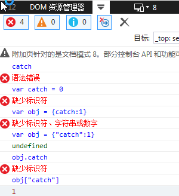

# Promise 及异步编程的学习

## 学习资料

- 【已读】[Promise迷你书](http://liubin.org/promises-book/)
- [Promise/A+ 规范-英](https://promisesaplus.com/)
- [Promise/A+ 规范-中](https://leohxj.gitbooks.io/front-end-database/content/javascript-asynchronous/promise-standard.html)
- [JavaScript Promise启示录 ](http://www.alloyteam.com/2014/05/javascript-promise-mode/)
- [Promise的实现](https://github.com/fsjohnhuang/iPromise)
- [深入理解 Promise 五部曲](https://segmentfault.com/a/1190000000586666)
- [剖析Promise内部结构](https://github.com/xieranmaya/blog/issues/3)
- [深入理解 Promise 五部曲](https://segmentfault.com/a/1190000000586666)


## 学习笔记

1. promise.then 成功和失败时都可以使用。 另外在只想对异常进行处理时可以采用 promise.then(undefined, onRejected) 这种方式，只指定reject时的回调函数即可。 不过这种情况下 promise.catch(onRejected) 应该是个更好的选择。
    ```
    promise.then(onFulfilled).catch(onRejected)
    // 等同于
    promise.then(onFulfilled).then(undefined,onRejected)
    ```

2. 可以通过静态方法来创建实例,这种方式在写测试用例时十分有用
    ```
    Promise.resolve("hello");
    //等同于
    new Promise(function(resolve){
        resolve("hello");
    });
    
    Promise.reject("hello");
    //等同于
    new Promise(function(resolve,reject){
        reject("hello");
    });
    ```

3. Promise只能使用异步调用方式 
    ```
    var promise = new Promise(function (resolve){
        console.log("inner promise"); // 1
        resolve(42);
    });
    promise.then(function(value){
        console.log(value); // 3
    });
    console.log("outer promise"); // 2

    output:
    //inner promise
    //outer promise
    // 42
    ```

    此处，then方法只是注册了一个promise状态变为resolve时的回调，而不是真正的执行回调，因此程序会继续向下执行，输出`outer promise`，最后待其他代码块执行完之后再执行回调。即使在调用 promise.then 注册回调函数的时候promise对象已经是确定的状态，Promise也会以异步的方式调用该回调函数.


4. IE8的catch问题

    

    在ECMAScript3中保留字是不能作为对象的属性名使用的。而IE8及以下版本都是基于ECMAScript 3实现的，因此不能将 catch 作为属性来使用，也就不能编写类似 promise.catch() 的代码，因此就出现了 identifier not found 这种语法错误了。

    解决办法：

    ```

    报错 ，IE8及以下版本则会出现 identifier not found 的语法错误。
    var promise = Promise.reject(new Error("message"));
    promise.catch(function (error) {
        console.error(error);
    });

    // 解决方法1. 中括号标记法
    var promise = Promise.reject(new Error("message"));
    promise["catch"](function (error) {
        console.error(error);
    });

    // 解决方法2. 使用Promise#then代替Promise#catch
    var promise = Promise.reject(new Error("message"));
    promise.then(undefined, function (error) {
        console.error(error);
    });
    ```

5. 每次调用then都会返回一个新创建的promise对象
    ```
    var aPromise = new Promise(function (resolve) {
        resolve(100);
    });
    var thenPromise = aPromise.then(function (value) {
        console.log(value);
    });
    var catchPromise = thenPromise.catch(function (error) {
        console.error(error);
    });
    console.log(aPromise !== thenPromise); // => true
    console.log(thenPromise !== catchPromise);// => true
    ```
    错误的使用方式：
    ```
    function badAsyncCall() {
        var promise = Promise.resolve(1);
        promise.then(function(valeu) {
            // 任意处理
            return valeu + 1;
        });
        return promise;
    }

    badAsyncCall().then(function(value){
        console.log(value);// output:1 ,not 2
    })
    ```

6. Promise.all
    + Promise.all(Array)数组中的执行顺序是固定的，传给then方法的结果也是对应顺序的 数组。数组中的任务不是顺序的执行的，而是同时开始，并行执行的，否则时间会大于128ms。
    + Promise.all 参数中的任务状态都改变为`FullFilled`或者`Rejected`后才会执行then中的回调。
    ```
    // `delay`毫秒后执行resolve
    function timerPromisefy(delay) {
        return new Promise(function (resolve) {
            setTimeout(function () {
                resolve(delay);
            }, delay);
        });
    }
    var startDate = Date.now();
    // 所有promise变为resolve后程序退出
    Promise.all([
        timerPromisefy(1),
        timerPromisefy(32),
        timerPromisefy(64),
        timerPromisefy(128)
    ]).then(function (values) {
        console.log(Date.now() - startDate + 'ms');
        // 约128ms
        console.log(values);    // [1,32,64,128]
    });
    ```

7. Promise.race 
    + 与Promise.all相对， 只要有一个promise对象进入 `FulFilled` 或者 `Rejected` 状态的话，就会继续进行后面的处理
    + 在第一个promise对象变为`Fulfilled`或者 `Rejected`之后，并不会取消其他promise对象的执行
    ```
    var aPromise = new Promise(function (resolve) {
            setTimeout(function () {
                console.log('this is a');
                resolve('this is a');
            }, 4);
        });
    var bPromise = new Promise(function (resolve) {
            setTimeout(function () {
                console.log('this is b');
                resolve('this is b');
            }, 1000);
        });
    // 第一个promise变为resolve后程序停止
    Promise.race([aPromise, bPromise]).then(function (value) {
        console.log(value);    // => 'this is winner'
    });
    ```

8. then or catch的不同
    + 使用promise.then(onFulfilled, onRejected) 的话,在 onFulfilled中发生异常的话，在 onRejected 中是捕获不到这个异常的。
    + 在 promise.then(onFulfilled).catch(onRejected) 的情况下
    then 中产生的异常能在.catch 中捕获
    + .then 和 .catch 在本质上是没有区别的,需要分场合使用。

9. 在Promise中使用 throw 语句的话，会被 `try...catch` 住，最终promise对象变为Rejected状态。
    ```
    var promise = new Promise(function(resolve, reject){
        throw new Error("error message");
    });
    promise.catch(function(error){
        console.log(error);// => "error message"
    });
    ```

10. Deferred 是对Promise的进一步封装，Deferred内涵了Promise
    ```
    function Deferred() {
        this.promise = new Promise(function (resolve, reject) {
            this._resolve = resolve;
            this._reject = reject;
        }.bind(this));
    }
    Deferred.prototype.resolve = function (value) {
        this._resolve.call(this.promise, value);
    };
    Deferred.prototype.reject = function (reason) {
        this._reject.call(this.promise, reason);
    };
    ```

    优点：
    1. 使用时可减少函数嵌套
    2. 不必将业务逻辑写在Promise中，只需在特定死机调用resolve、reject即可。

    原理：调用promise的resolve、reject方法来改变promise的状态（通过特殊途径调用，常的Promise的话只能在通过构造函数传递的方法之内对promise对象的状     态进行操作）

    对以下代码进行封装后可得到Deferred:

    ```
    var _resolve, _reject;
    var promise;
    function getURL(URL) {
        promise = new Promise(function(resolve, reject) {
            _resolve = resolve;
            _reject = reject;
        });
        var req = new XMLHttpRequest();
        req.open('GET', URL, true);
        req.onload = function() {
            if (req.status === 200) {
                _resolve.call(promise, req.responseText);
            } else {
                _reject.call(promise, new Error(req.statusText));
            }
        };
        req.onerror = function() {
            reject.call(promise, new Error(req.statusText));
        };
        req.send();
        return promise;
    }
    // 运行示例
    var URL = "http://httpbin.org/get";
    getURL(URL).then(function onFulfilled(value) {
        console.log(value);
    }).catch(console.error.bind(console));
    ```

 封装后：
    ```
    function Deferred() {
        this.promise = new Promise(function (resolve, reject) {
            this._resolve = resolve;
            this._reject = reject;
        }.bind(this));
    }
    Deferred.prototype.resolve = function (value) {
        this._resolve.call(this.promise, value);
    };
    Deferred.prototype.reject = function (reason) {
        this._reject.call(this.promise, reason);
    };
    function getURL(URL) {
        var deferred = new Deferred();
        var req = new XMLHttpRequest();
        req.open('GET', URL, true);
        req.onload = function () {
            if (req.status === 200) {
                deferred.resolve(req.responseText);
            } else {
                deferred.reject(new Error(req.statusText));
            }
        };
        req.onerror = function () {
            deferred.reject(new Error(req.statusText));
        };
        req.send();
        return deferred.promise;
    }
    // 运行示例
    var URL = "http://httpbin.org/get";
    getURL(URL).then(function onFulfilled(value){
        console.log(value);
    }).catch(console.error.bind(console));
    ```
    参考至：[https://developer.mozilla.org/en-US/docs/Mozilla/JavaScript_code_modules/Promise.jsm/Deferred](https://developer.mozilla.org/en-US/docs/Mozilla/JavaScript_code_modules/Promise.jsm/Deferred)

11. Promise.prototype.done
    - Promise.prototype.done并不在ES6的规范中，由第三方来实现
    - Promise.prototype.done在执行链的最后执行
    - 在使用Promise时，需要注意异常的处理，由于catch可以捕获产生的异常，如果在catch中未做处理，则调试代码时不易定位问题。
    - 在try catch中使用setimeout抛出的异常不会被catch到，而是抛给外层。
    - 一个现实：
    ```
    if (typeof Promise.prototype.done === "undefined") {
        Promise.prototype.done = function(onFulfilled,onRejected){
            this.then(onFulfilled,onRejected).catch(function(error){

                // 此处应抛出异常到外部，显示提供给外部，否则此处捕获之后外界无法感知，增加定位问题的成本
                // 除非明确知道要做什么，否则扩展的功能不应该处理异常的情况
                setTimeout(function () {
                    throw error;
                }, 0);
            });
        };
    }
    ```

12. 
