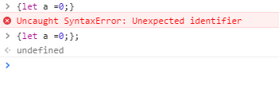

# let const关键字笔记

1. let所声明的变量，只在let命令所在的代码块内有效
常见的例子:
	
	```
	var a = [];
	for (let i = 0; i < 10; i++) {
	    a[i] = function() {
	        console.log(i);
	    };
	}
	
	a[6]();// 6
	```
	
	一句let所申明的变量在块级作用域有效并不能解释下面的代码，详细的解释是：
	for循环花括号中的块，每进入一次花括号就生成了一个块级作用域，而每次在块级作用域中又定义了一个函数,根据作用域链的知识，函数体中的i为函数外部作用域中的变量，而每个作用域中的i值又不一样,并且只在对应作用域中有效,但是变量i只有一个，这里相当于下面代码，所以结果是6：
	
	```
	var a = [];
	for (let i = 0; i < 10; i++) {
	    let j = i;
	    a[j] = function() {
	        console.log(j);
	    };
	}
	a[6]();// 6
	```

2. 块级作用域与函数声明
	- ES6引入了块级作用域，明确允许在块级作用域之中声明函数，并且ES6规定，块级作用域之中，函数声明语句的行为类似于let，在块级作用域之外不可引用。
	- 处于兼容性考虑，对于支持ES6的浏览器而言（不支持的的则忽略下面规则），块级作用域中申明的函数，有下面几条规则  
	  - 允许在块级作用域内声明函数。
	  - 函数声明类似于var，即会提升到全局作用域或函数作用域的头部。 
	  - 函数声明还会提升到所在的块级作用域的头部。
	
	```
	// ES6的浏览器环境
	function f() { console.log('I am outside!'); }
	(function () {
	  if (false) {
	    // 重复声明一次函数f
	    function f() { console.log('I am inside!'); }
	  }
	
	  f();
	}());
	// Uncaught TypeError: f is not a function
	```

3. 在非块级作用域(如全局作用域)中定义块级作用域时，}后需要使用分号“;”，否则会报错
